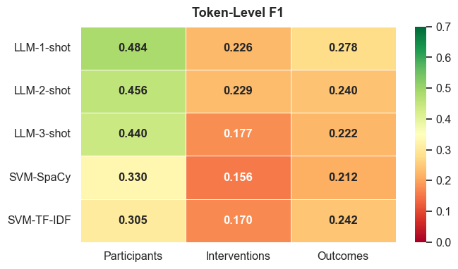
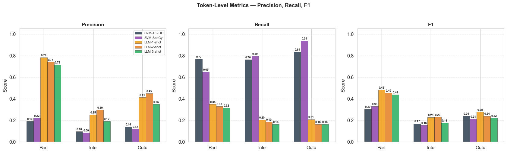
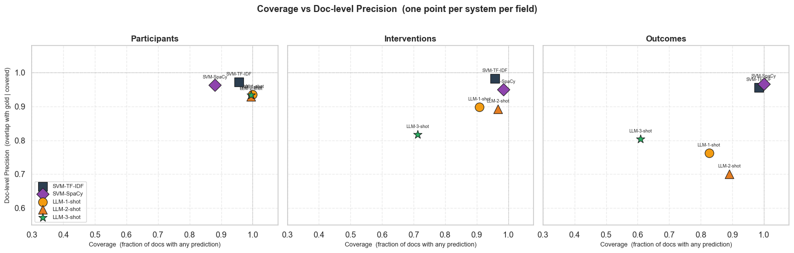
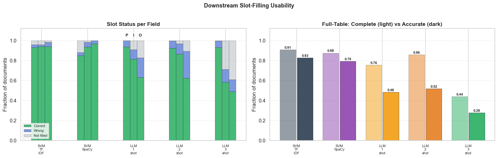
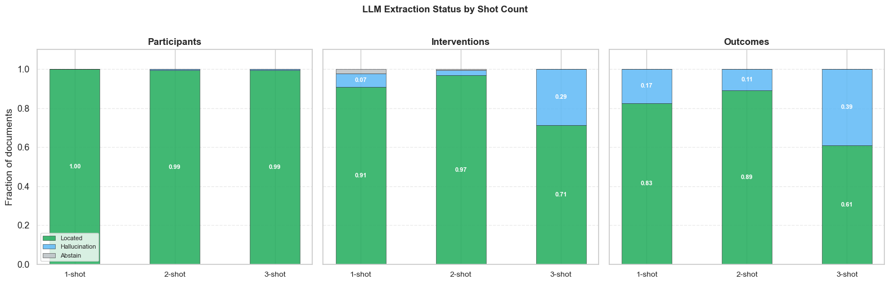

# PICO Extraction — Evaluation Results

This document evaluates five PICO extraction systems on 184 clinical trial abstracts from the **EBM-NLP** benchmark dataset.
Each system attempts to identify three structured fields per abstract: **Participants (P)**, **Interventions (I)**, and **Outcomes (O)**.

Two paradigms are compared:

| System | Type | Approach |
|--------|------|----------|
| **SVM-TF-IDF** | Discriminative | Sentence-level classifier using TF-IDF bag-of-words features |
| **SVM-SpaCy** | Discriminative | Sentence-level classifier using SpaCy dense word vectors |
| **LLM-1-shot** | Generative | LLaMA 3.1 prompted with one in-context example |
| **LLM-2-shot** | Generative | LLaMA 3.1 prompted with two in-context examples |
| **LLM-3-shot** | Generative | LLaMA 3.1 prompted with three in-context examples |

The evaluation covers three dimensions required by the assignment:
- **(a)** Field-level accuracy and F1
- **(b)** Coverage vs Precision trade-off
- **(c)** Downstream usability

---

## (a) Field-Level Accuracy

### Figure 1 — Token-Level F1 by System and Field

**What it shows.**
Each cell reports the token-level F1 score for one system on one PICO field.
Every word in every abstract is a binary instance — positive if it belongs to the field,
negative otherwise. TP, FP, and FN are aggregated across all 184 documents before computing F1.

**Results.**

| System | Participants | Interventions | Outcomes |
|--------|:-----------:|:-------------:|:--------:|
| LLM-1-shot | **0.484** | 0.226 | 0.278 |
| LLM-2-shot | 0.456 | **0.229** | 0.240 |
| LLM-3-shot | 0.440 | 0.177 | 0.222 |
| SVM-SpaCy | 0.330 | 0.156 | 0.212 |
| SVM-TF-IDF | 0.305 | 0.170 | **0.242** |

**Key findings.**
- LLM-1-shot achieves the highest F1 on Participants (0.484) and LLM-2-shot on Interventions (0.229). The LLM family consistently outperforms SVM on this metric.
- All systems score poorly on Interventions (max 0.229) — this is the hardest field, as intervention descriptions are often spread across multiple clauses with complex terminology.
- SVM-TF-IDF and SVM-SpaCy score similarly, confirming that feature representation (TF-IDF vs dense vectors) is not the main performance bottleneck for this task.
- The overall low F1 values for all systems reflect the fundamental difficulty of the task: token-level F1 is a strict metric that penalises any mismatch in span boundaries.

---

### Figure 2 — Precision, Recall, and F1 Breakdown

**What it shows.**
The same token-level counts are split into Precision, Recall, and F1 separately,
making the contrasting operating modes of SVM and LLM immediately visible.

**Results.**

*Precision (fraction of predicted tokens that are correct):*

| System | Participants | Interventions | Outcomes |
|--------|:-----------:|:-------------:|:--------:|
| LLM-1-shot | **0.78** | **0.25** | 0.41 |
| LLM-2-shot | 0.74 | 0.30 | **0.45** |
| LLM-3-shot | 0.72 | 0.19 | 0.35 |
| SVM-TF-IDF | 0.19 | 0.10 | 0.14 |
| SVM-SpaCy | 0.22 | 0.09 | 0.12 |

*Recall (fraction of gold tokens that are found):*

| System | Participants | Interventions | Outcomes |
|--------|:-----------:|:-------------:|:--------:|
| SVM-TF-IDF | 0.77 | 0.76 | 0.84 |
| SVM-SpaCy | 0.65 | **0.80** | **0.94** |
| LLM-1-shot | 0.35 | 0.20 | 0.21 |
| LLM-2-shot | 0.33 | 0.19 | 0.16 |
| LLM-3-shot | 0.32 | 0.16 | 0.16 |

**Key findings.**
- **SVM and LLM operate in fundamentally different regions.** SVM precision is very low (0.09–0.22) because sentence-level classifiers mark entire sentences, flooding the prediction with non-PICO tokens. LLM precision is high (0.19–0.78) because the model extracts short focused phrases.
- **The trade-off reverses for Recall.** SVM recall reaches 0.94 for Outcomes (SVM-SpaCy) because marking the whole sentence guarantees the gold tokens are always covered. LLM recall is low (0.16–0.35) because a short phrase misses the remaining parts of multi-span annotations.
- **Increasing shot count degrades LLM performance.** LLM-3-shot has lower precision *and* lower recall than LLM-1-shot across nearly all fields — more in-context examples appear to confuse rather than guide the model.
- **F1 favours LLM** because precision is substantially higher for LLM while recall is only moderately lower, making the harmonic mean larger.

---

## (b) Coverage vs Precision

### Figure 3 — Document-Level Coverage vs Precision

**What it shows.**
Each point represents one system on one PICO field, placed at coordinates:
- **x-axis (Coverage)**: fraction of documents where the system predicted at least one token.
- **y-axis (Doc-level Precision)**: of those covered documents, fraction where the prediction overlaps gold.

Systems in the top-right corner are ideal (always predict, always correct).
Systems in the lower-left abstain too often or predict incorrectly.

**Results.**

*Participants* (left panel): All five systems cluster tightly in the top-right corner — coverage 0.88–1.00, doc-precision 0.92–0.97. Participants is the easiest field for all systems.

*Interventions* (centre panel): SVM systems achieve perfect coverage (1.00) and near-perfect doc-precision (0.95–1.00). LLM-1-shot and LLM-2-shot drop to coverage 0.91 with doc-precision 0.88–0.91. **LLM-3-shot falls dramatically to coverage 0.71 and doc-precision 0.82** — one in three documents receives no prediction at all.

*Outcomes* (right panel): SVM systems maintain perfect coverage (1.00) and high doc-precision (~0.96–0.97). LLM-1-shot covers 83% of documents with 76% doc-precision. LLM-2-shot covers 89% but doc-precision drops to 0.70. **LLM-3-shot covers only 61% of documents** — the worst coverage of any system on any field.

**Key findings.**
- **SVM dominates on coverage.** By marking whole sentences, SVM virtually guarantees that some prediction is always made, achieving ≥98% coverage on every field.
- **LLM coverage degrades monotonically with shot count.** This is counter-intuitive: additional examples make the model *more selective*, causing it to abstain on documents where it is uncertain rather than making a best guess.
- **The Outcomes field is the hardest for LLM.** Outcome descriptions are often multi-sentence and diffuse; the LLM struggles to identify a single extractable phrase, leading to abstentions.
- **High SVM doc-precision despite low token-precision** (Figure 2) occurs because the predicted sentence almost always contains at least one gold token, even if the surrounding words are not gold.

---

## (c) Downstream Usability

### Figure 4 — Slot-Filling Usability

**What it shows.**
PICO extraction is ultimately used to populate a structured clinical database with three fields per abstract. This figure simulates that task:

- **Left panel**: For each system and each field (P/I/O), the bar shows what fraction of documents had the slot correctly filled (green), incorrectly filled (blue), or not filled at all (grey).
- **Right panel**: The light bar shows **Table Completeness** (all three slots filled), and the dark bar shows **Table Accuracy** (all three slots filled *and* all correct).

**Results.**

| System | Table Completeness | Table Accuracy |
|--------|:-----------------:|:--------------:|
| **SVM-TF-IDF** | **0.91** | **0.83** |
| SVM-SpaCy | 0.88 | 0.79 |
| LLM-2-shot | 0.86 | 0.52 |
| LLM-1-shot | 0.76 | 0.48 |
| LLM-3-shot | 0.44 | 0.28 |

**Key findings.**
- **SVM-TF-IDF is the best system for practical database population**, achieving 83% table accuracy — correctly filling all three fields in 83 out of every 100 documents.
- **LLM-3-shot is the worst**, with table accuracy of only 0.28. The near-complete Outcomes abstention (coverage 61% from Figure 3) means most documents fail the completeness check before accuracy is even assessed.
- **LLM-2-shot is the best LLM variant for usability** (0.52 accuracy), but still 31 percentage points behind SVM-TF-IDF.
- **The gap between Completeness and Accuracy reveals where each system fails.** For SVM systems, the gap is small (0.91 → 0.83, gap = 0.08), meaning filled slots are almost always correct. For LLM-1-shot, the gap is larger (0.76 → 0.48, gap = 0.28), meaning even when all slots are filled, many are inaccurate — a consequence of hallucinations.
- **Left panel pattern:** SVM-TF-IDF bars are almost entirely green across all three fields. LLM-3-shot Outcomes bars show significant grey (not filled) and blue (wrong) fractions, confirming the abstention and precision problems seen in earlier figures.

---

## Supplementary Analysis — LLM Error Modes

### Figure 5 — LLM Extraction Status by Shot Count

**What it shows.**
For each LLM variant and each field, every prediction is classified as:
- **Located** (green): the extracted span can be found in the source document.
- **Hallucination** (blue): the extracted text cannot be located in the document (similarity < 0.6) — the model fabricated text.
- **Abstain** (grey): the model returned null.

Hallucinations are more dangerous than abstentions in a clinical setting because they silently insert false information into a database.

**Results.**

*Participants*: All three LLM variants achieve near-perfect located rates (1.00 / 0.99 / 0.99). Participants is a simple demographic description that the model reliably identifies and correctly quotes.

*Interventions*: Located rates fall as shot count increases: 1-shot = 0.91, 2-shot = 0.97, **3-shot = 0.71** with 29% hallucinations. Three-shot prompting nearly triples the hallucination rate compared to one-shot.

*Outcomes*: The most severe degradation. Located rates: 1-shot = 0.83, 2-shot = 0.89, **3-shot = 0.61**, with **39% hallucination** at 3-shot. Four in ten Outcome predictions from LLM-3-shot are fabricated text.

**Key findings.**
- **Hallucination, not abstention, is the primary failure mode.** The grey abstain segment is almost invisible; the blue hallucination segment drives the increase in failures.
- **More few-shot examples increase hallucination monotonically for Interventions and Outcomes.** This strongly suggests that the additional examples in the prompt introduce ambiguity or distract the model rather than providing guidance.
- **Participants is qualitatively easier than Interventions and Outcomes.** Participant descriptions (age, condition, sample size) follow predictable syntactic patterns that the model has seen extensively in pre-training, making them easy to quote accurately.
- **This finding directly explains Figure 3 (Coverage) and Figure 4 (Usability):** LLM-3-shot's poor table accuracy (0.28) is driven primarily by Outcome hallucinations degrading slot accuracy, compounded by the 39% of documents where no valid span is located.

---

## Overall Summary

| Metric | Best System | Worst System |
|--------|------------|-------------|
| Token F1 (Participants) | LLM-1-shot (0.484) | SVM-TF-IDF (0.305) |
| Token F1 (Interventions) | LLM-2-shot (0.229) | SVM-SpaCy (0.156) |
| Token F1 (Outcomes) | LLM-1-shot (0.278) | SVM-SpaCy (0.212) |
| Token Precision | LLM family | SVM family |
| Token Recall | SVM family | LLM family |
| Document Coverage | SVM-TF-IDF (≥98%) | LLM-3-shot (44–61%) |
| Table Accuracy | **SVM-TF-IDF (0.83)** | LLM-3-shot (0.28) |
| Fewest Hallucinations | SVM-TF-IDF (0%) | LLM-3-shot (up to 39%) |

### Conclusion

The two system families make fundamentally different errors:

**SVM systems** mark entire sentences, so they are verbose (low precision) but comprehensive (high recall, high coverage). Because the correct tokens are almost always somewhere in the predicted sentence, downstream slot-filling accuracy is high. SVM-TF-IDF achieves **83% table accuracy**, making it the most practically useful system for populating a clinical evidence database.

**LLM systems** extract short, precise phrases (high precision) but frequently miss parts of multi-span annotations (low recall) and increasingly abstain or hallucinate as the number of in-context examples grows. LLM-1-shot is the best LLM variant, but its table accuracy (48%) is 35 points below SVM-TF-IDF. The counter-intuitive finding that **more few-shot examples hurt performance** — with LLM-3-shot hallucinating 39% of Outcome predictions — suggests that prompt design (field definitions, constraints, output format) is far more important than the number of examples provided.

For use cases requiring **complete structured records** (clinical databases, systematic review tools), SVM-TF-IDF is the recommended system. For use cases requiring **precise short phrases for human review** (evidence highlighting, expert annotation support), LLM-1-shot offers the best precision with the fewest hallucinations.
