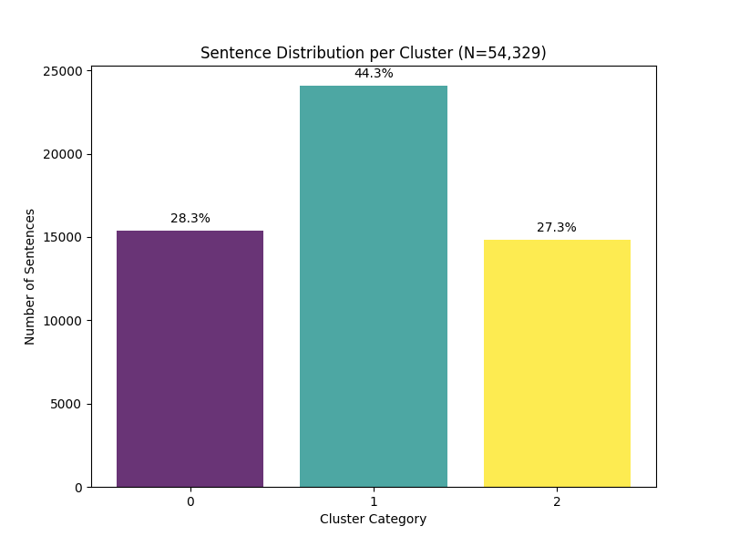
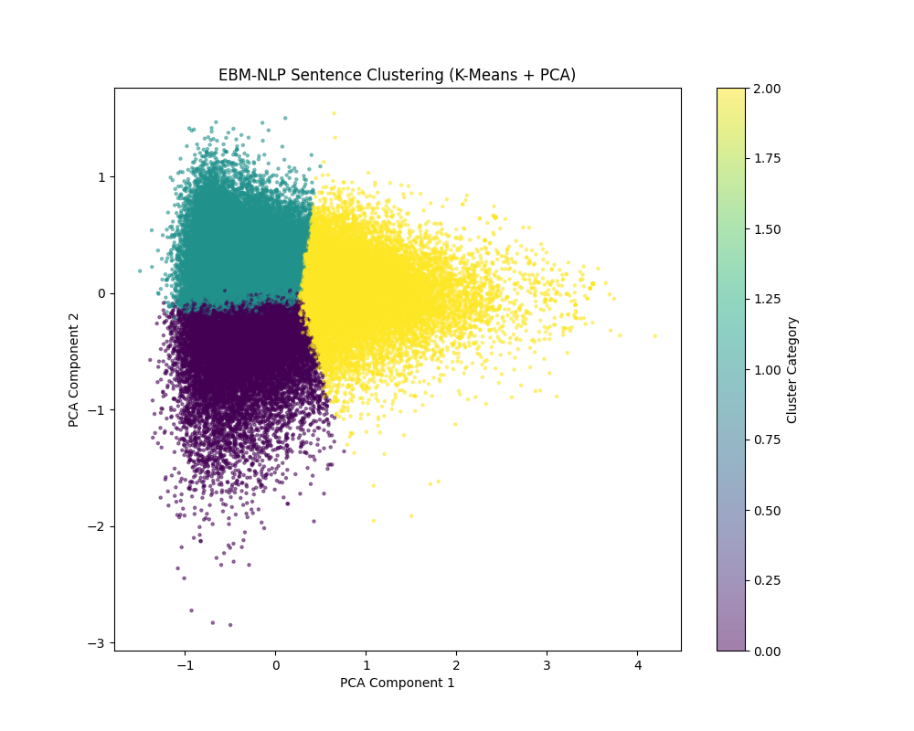

# Task 1: Sentence Clustering Analysis 

This project is a clustering analysis on the EBM-NLP dataset, covering all **54,329 sentences**. It uses 300D SpaCy embeddings (`en_core_web_md`) and K-Means ($K=3$) to find the structure of medical abstracts.

## 1. Results & Cluster Sizes
The 54,329 sentences are divided into three groups. The distribution shows how different parts of a medical abstract are organized:

* **Cluster 0 (28.3%):** Trial Methods & Design
* **Cluster 1 (44.3%):** Findings & Patient Descriptions
* **Cluster 2 (27.3%):** Results & Time Data

## 2. Keyword Analysis
To see what each cluster means, the top 10 most frequent words were collected. The words match the **PICO** framework (Population, Intervention, Comparison, Outcome) very well:

### Cluster 0 (Methods / Intervention)
`treatment (2103), randomized (1832), trial (1639), therapy (1306), after (1198), cancer (1064), effects (1050), controlled (1021), effect (940), placebo (913)`
* **Note:** This group is full of RCT words, covering the **Intervention** and **Comparison** parts.

### Cluster 1 (Results / Population)
`treatment (2857), this (2546), not (2034), results (1927), groups (1823), between (1630), after (1621), significant (1613), children (1463), intervention (1335)`
* **Note:** This group focuses on comparing results and describing the people in the study (like *children*).

### Cluster 2 (Metrics / Outcomes)
`after (1737), placebo (1735), treatment (1579), than (1430), months (1320), significantly (1308), results (1288), groups (1216), mean (1215), day (1135)`
* **Note:** This group has many measurement words (*mean, months, day*), showing the statistical **Outcomes**.

## 3. 2D Plot (PCA)
PCA was used to change the 300D data into 2D, making it easier to see the three clusters:

---

## 4. Scripts & Workflow
The work is done in three main steps:

1.  **`my_data_loader.py`**: Loads and cleans the 54,329 sentences.
2.  **`my_clustering.py`**: Creates vectors, runs K-Means, and saves the plots.
3.  **`check_clusters.py`**: Checks the results by looking at random sentences and word counts.

## 5. How to Run
1.  **Setup:** Install the SpaCy model: `python -m spacy download en_core_web_md`
2.  **Order:** Run the scripts like this:
    * `python my_data_loader.py`
    * `python my_clustering.py`
    * `python check_clusters.py`
