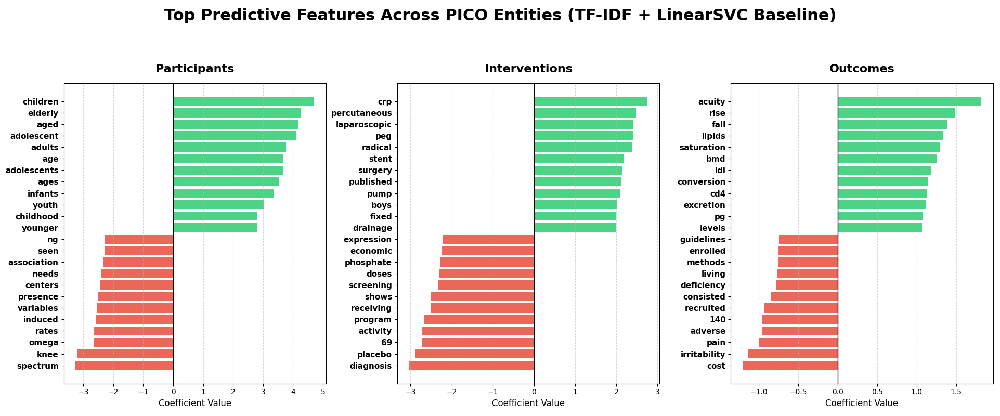
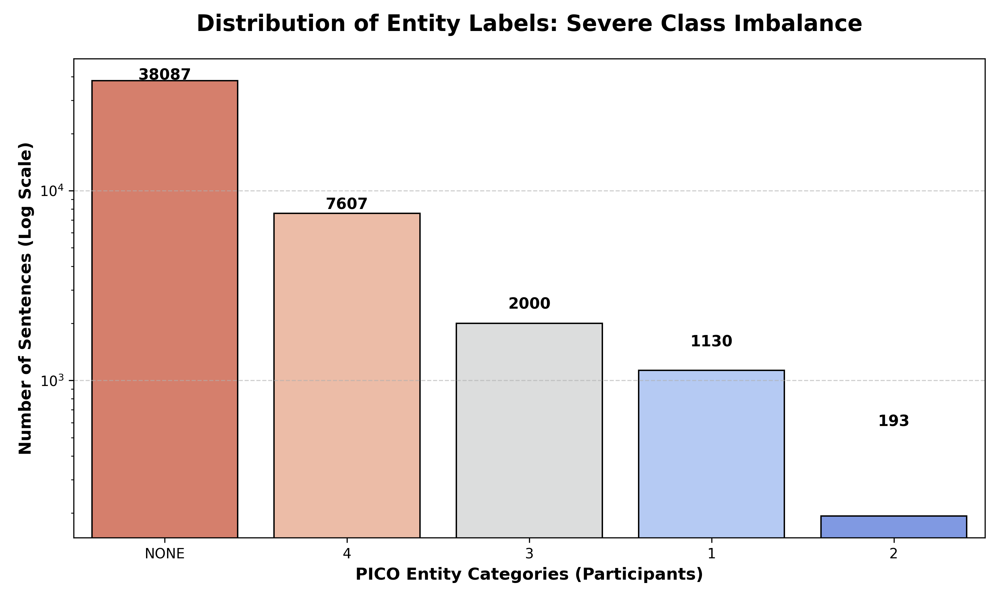
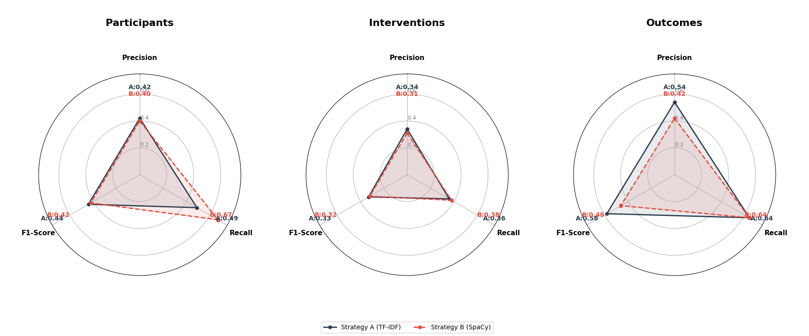
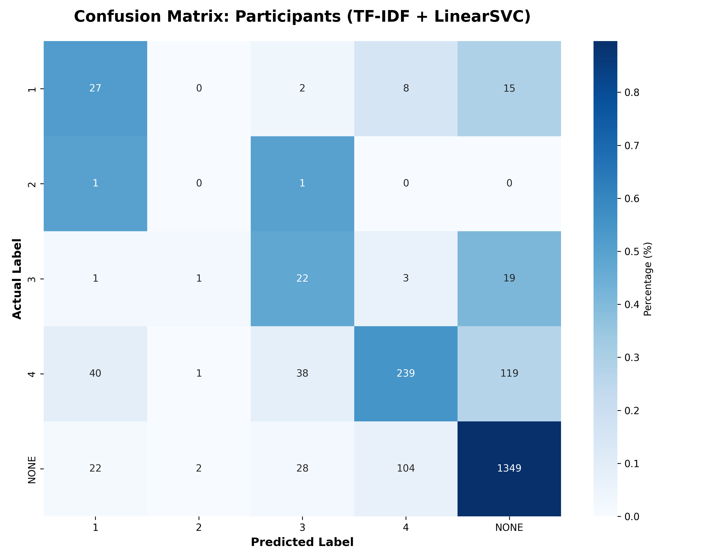
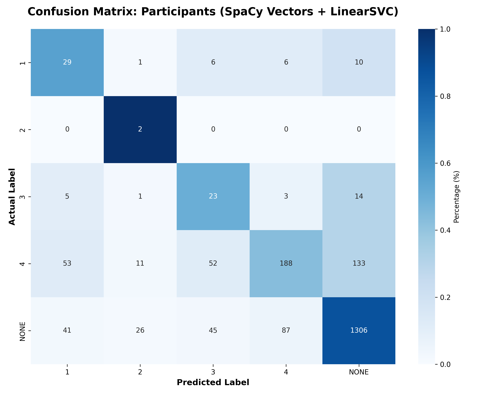

# Task 2-2: Machine Learning Baseline for EBM-NLP

I developed a machine learning baseline for PICO information extraction. This pipeline provides a standard benchmark for evaluating various design approaches.

## 1. Information Extraction Pipeline

The extraction process is designed as a four-stage pipeline:

1. **Preprocessing**: Cut long medical texts into sentences. Label each sentence using a "majority wins" rule.
2. **Feature Extraction**: Turn words into numbers.
3. **Classification**: Train a **LinearSVC** model to sort sentences into the correct PICO categories.
4. **Evaluation**: Create charts to see how well the model works and where it makes mistakes.

## 2. Design Axes and Hypotheses

The experiment compares two main axes :

### Axis 1: Machine Learning (ML) vs. Large Language Models (LLMs)
* **Approaches Compared**: Statistical learning (**LinearSVC**) vs. Generative models (**LLMs**).
* **Hypothesis**: Machine Learning models are expected to be more efficient and precise for identifying fixed medical terms. However, LLMs are expected to have a better understanding of complex sentence structures, though they require significantly more computing power.

### Axis 2: Lexical vs. Semantic Representation
* **Approaches Compared**: **TF-IDF** (Counting specific words) vs. **SpaCy Vectors** (Understanding word relationships).
* **Hypothesis**: TF-IDF will be highly effective for standardized clinical units (like "mg" or "years"). Semantic vectors will perform better when the same medical concept is described using different words.

## 3. Visual Analysis

The experimental hypotheses are validated through the following visual reports:

### 3.1 Feature Importance

The feature importance chart visualizes the words the model relies on most. Green bars represent positive indicators and red bars represent negative ones. This proves the model successfully captured the medical context, such as identifying "children" and "elderly" for Participants, and "surgery" for Interventions. This shows that the word frequency strategy effectively extracts highly recognizable medical terms.

### 3.2  Severe Class Imbalance

The class distribution chart reveals the most severe challenge of this experiment: extreme data imbalance. The logarithmic chart shows over 38,000 sentences are labeled as 'NONE', vastly outnumbering actual PICO entities. This massive gap proves the necessity of using a "balanced weight" strategy, as a model could otherwise achieve high accuracy simply by guessing the background class every time, causing the extraction task to fail completely.

### 3.3 Strategy A vs. Strategy B

The radar chart compares the performance trade-offs between matching exact words (Strategy A) and understanding word meaning (Strategy B). Strategy A achieves higher precision, making it very accurate when locking onto fixed medical terms. Conversely, Strategy B excels in recall, especially for Participants, showing it catches more potential information by understanding meanings, though this introduces more false positives.

### 3.4 Confusion Matrices

The confusion matrix for the word frequency strategy details the classification errors, with the dark blue square in the bottom right confirming the dominance of background noise. The strategy reliably recognized label "4" with 239 correct predictions, proving that exact keyword matching offers very stable classification performance for sentences with specific word patterns.

The confusion matrix for the semantic vector strategy shows a different pattern, with predictions spread more broadly across categories. Comparing the two matrices shows the core difficulty is isolating weak entity signals from massive background noise. While semantic understanding helps recognize synonyms, it also increases the risk of mistaking noise for valid information, pointing the way for future improvements with more advanced models.

